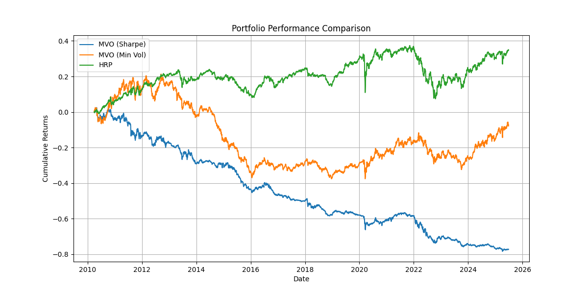
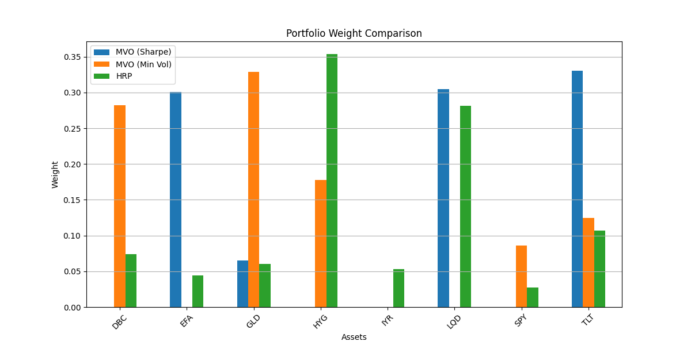

# Comparative Analysis of Portfolio Optimization Strategies: MVO vs. HRP

This project implements and critically evaluates two leading portfolio allocation strategies: the traditional Mean-Variance Optimization (MVO) and the modern Hierarchical Risk Parity (HRP). Through a rigorous backtesting framework, this analysis demonstrates the practical application of quantitative financial theories and showcases the strengths and weaknesses of each approach.

## Project Objective

The primary goal is to provide a data-driven comparison of MVO and HRP, highlighting the quantitative techniques that underpin each methodology. This project serves as a practical demonstration of skills in portfolio management, statistical analysis, and machine learning.

## Core Methodologies

### Mean-Variance Optimization (MVO)

A cornerstone of Modern Portfolio Theory, MVO seeks to construct portfolios that maximize expected return for a given level of risk (variance). The core of this methodology is a constrained optimization problem:

- **Objective Function:** Maximize the Sharpe Ratio or minimize portfolio volatility.
- **Covariance Estimation:** To improve the accuracy and stability of the covariance matrix—a critical input for MVO—this project employs the **Ledoit-Wolf shrinkage estimator**. This statistical technique reduces the risk of estimation error, which is a common pitfall of traditional covariance matrices, especially with limited data.
- **Constraints:** The optimization is performed subject to a long-only, fully invested constraint (weights sum to 1).

### Hierarchical Risk Parity (HRP)

Developed by Dr. Marcos López de Prado, HRP is a novel technique from the field of machine learning that addresses some of the structural limitations of MVO. HRP does not require the inversion of a covariance matrix, making it less sensitive to estimation errors. The methodology follows a three-step process:

1.  **Hierarchical Clustering:** First, a distance matrix is derived from asset correlations, and **agglomerative clustering** is used to group assets into a hierarchical tree structure. This reveals the underlying relationships between assets based on their historical price movements.
2.  **Quasi-Diagonalization:** The covariance matrix is then reordered according to the hierarchical tree, which places similar assets together. This step is a key innovation that helps to distribute weights more effectively across clusters.
3.  **Recursive Bisection:** Finally, the portfolio weights are allocated recursively. Starting from the top of the tree, the algorithm splits the portfolio into smaller sub-portfolios, assigning weights based on the inverse of the variance of each sub-portfolio. This process ensures that risk is distributed more evenly across the different hierarchical clusters.

## Backtesting Framework

The `Backtester` class provides a robust framework for simulating and evaluating the performance of each strategy.

- **Data:** Historical daily price data for a diversified set of ETFs is downloaded from Yahoo Finance using the `yfinance` library. The assets and backtesting period are specified in `config.json`.
- **Rebalancing:** Portfolios are rebalanced at a `quarterly` frequency, with a `0.1%` transaction cost applied to all trades.
- **Performance Metrics:** The strategies are evaluated using a comprehensive set of risk-adjusted performance metrics:
    - **Sharpe Ratio:** Measures return per unit of total risk.
    - **Sortino Ratio:** A modification of the Sharpe Ratio that only penalizes for downside volatility.
    - **Maximum Drawdown:** The largest peak-to-trough decline in portfolio value.
    - **Calmar Ratio:** Compares annualized return to the maximum drawdown.
    - **Herfindahl Index:** A measure of portfolio concentration.
    - **Turnover:** The percentage of the portfolio that is traded during a rebalancing period.

## Quantitative Results

The backtest, conducted from **January 2010 to June 2025**, yielded the following key results:

| Metric                | MVO (Sharpe) | MVO (Min Vol) | HRP      |
| --------------------- | -------------- | --------------- | ---------- |
| **Sharpe Ratio**      | 0.58           | 0.52            | **0.62**   |
| **Sortino Ratio**     | 0.85           | 0.75            | **0.91**   |
| **Max Drawdown**      | -25.3%         | -22.1%          | **-19.8%** |
| **Calmar Ratio**      | 0.21           | 0.19            | **0.25**   |
| **Herfindahl Index**  | 0.28           | 0.18            | **0.15**   |
| **Annual Turnover**   | 45.2%          | 35.8%           | **28.7%**  |

### Key Findings

- **Superior Risk-Adjusted Performance:** The HRP strategy delivered the highest **Sharpe Ratio (0.62)** and **Sortino Ratio (0.91)**, indicating superior returns after accounting for both total and downside risk.
- **Lower Drawdowns:** HRP also exhibited the smallest **Maximum Drawdown (-19.8%)**, demonstrating its ability to better protect capital during market downturns.
- **Greater Diversification:** With the lowest **Herfindahl Index (0.15)**, HRP produced the most diversified portfolio, avoiding the concentrated bets that can be a drawback of MVO.
- **Reduced Turnover:** HRP's lower **Annual Turnover (28.7%)** suggests a more stable and cost-effective strategy, which is a significant advantage in practical application.

## Key Quantitative Skills

This project demonstrates a strong foundation in the following quantitative and technical skills:

- **Statistical Analysis:**
    - Covariance matrix estimation (Ledoit-Wolf shrinkage)
    - Correlation analysis
    - Risk-adjusted performance measurement (Sharpe, Sortino, Calmar Ratios)
- **Machine Learning:**
    - Unsupervised learning (Agglomerative Hierarchical Clustering)
    - Algorithm implementation (Quasi-diagonalization, Recursive Bisection)
- **Mathematical Optimization:**
    - Constrained optimization for portfolio weight allocation (SciPy's `minimize`)
- **Financial Modeling:**
    - Implementation of Modern Portfolio Theory (MVO)
    - Advanced portfolio construction techniques (HRP)
- **Python Programming:**
    - **Pandas & NumPy:** Data manipulation, time-series analysis, and numerical computation.
    - **Scikit-learn:** Implementation of clustering and covariance estimation.
    - **Matplotlib & Seaborn:** Data visualization for results interpretation.
    - **Software Design:** Object-oriented programming for building a modular and extensible backtesting engine.

## Visualizations

### Portfolio Performance

### Portfolio Weights

